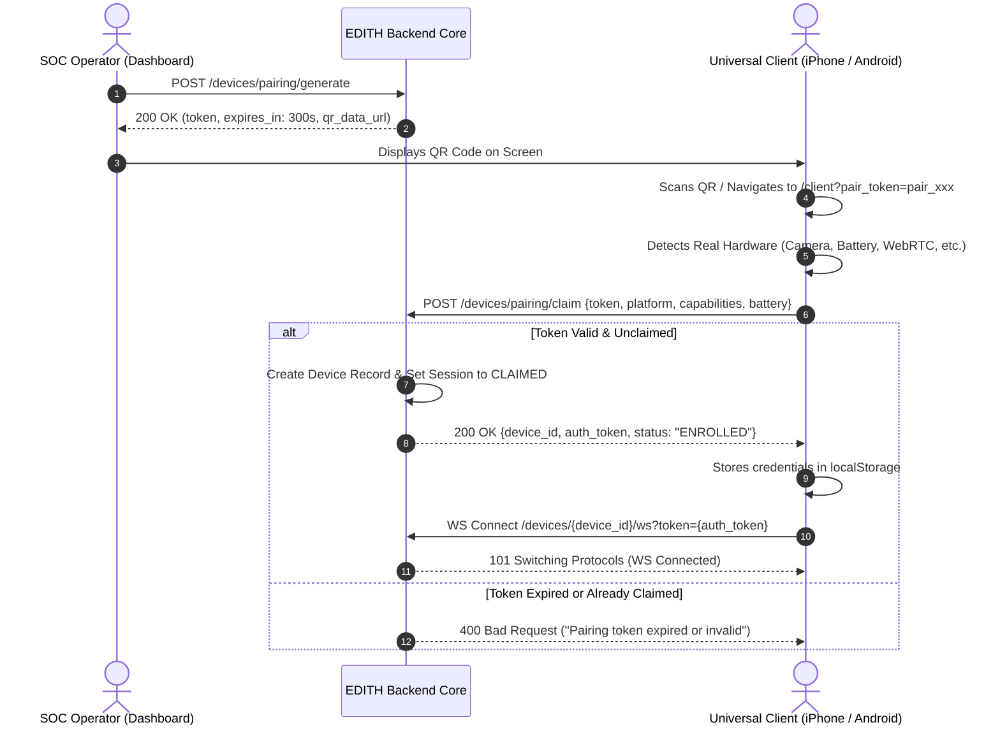

# EDITH-AI — Universal Device Enrollment & Pairing Protocol

## 1. Enrollment Workflows

The Universal Device Client Layer supports two primary enrollment workflows:

1. **Ephemeral QR Code Pairing** (Optimized for mobile companions, tablets, and smart glasses).
2. **Direct Client Registration** (Optimized for headless agents, developer tools, and automated background nodes).

---

## 2. Ephemeral QR Pairing Lifecycle



---

## 3. API Reference

### 3.1 `POST /api/v1/devices/pairing/generate`
* **Purpose**: Generates an ephemeral 5-minute single-use pairing session with a QR code.
* **Request Body**:
  ```json
  {
    "device_type": "PHONE",
    "device_name": "Field iPhone 6 Companion"
  }
  ```
* **Response**:
  ```json
  {
    "success": true,
    "pairing_token": "pair_a1b2c3d4e5f67890",
    "expires_at": "2026-10-06T23:35:00Z",
    "expires_in": 300,
    "client_url": "http://192.168.1.11:8000/client?pair_token=pair_a1b2c3d4e5f67890",
    "qr_data_url": "data:image/png;base64,iVBORw0KGgo..."
  }
  ```

### 3.2 `POST /api/v1/devices/pairing/claim`
* **Purpose**: Exchanges a valid pairing token for permanent device identity and cryptographically secure `auth_token`.
* **Request Body**:
  ```json
  {
    "pairing_token": "pair_a1b2c3d4e5f67890",
    "device_name": "Field iPhone 6",
    "device_type": "PHONE",
    "platform": "iOS",
    "operating_system": "iOS 12.5.7",
    "browser": "Mobile Safari",
    "client_version": "2.5.0",
    "capabilities": {
      "camera": true,
      "microphone": true,
      "battery": false,
      "websocket": true,
      "webrtc": true,
      "touch": true,
      "vibrate": false
    },
    "battery_level": null,
    "battery_charging": null
  }
  ```
* **Response**:
  ```json
  {
    "success": true,
    "device_id": "dev_a7f92e104c8b",
    "auth_token": "dauth_8d9f1a2e7c4b...",
    "device_name": "Field iPhone 6",
    "device_type": "PHONE",
    "platform": "iOS",
    "status": "ENROLLED",
    "message": "Device successfully enrolled in EDITH Defense Grid."
  }
  ```

### 3.3 `POST /api/v1/devices/{device_id}/command`
* **Purpose**: Dispatches allowlisted tactical command to an online enrolled device.
* **Allowlist**: `PING`, `CAPTURE_FRAME`, `TORCH_ON`, `TORCH_OFF`, `HUD_ALERT`, `VIBRATE`, `RECONNECT`.
* **Request Body**:
  ```json
  {
    "command": "HUD_ALERT",
    "payload": {
      "message": "DEFENSE GRID LEVEL 2 ELEVATION",
      "severity": "WARNING"
    }
  }
  ```
* **Response**:
  ```json
  {
    "success": true,
    "device_id": "dev_a7f92e104c8b",
    "command": "HUD_ALERT",
    "dispatched_to": 1,
    "status": "DELIVERED"
  }
  ```

### 3.4 `DELETE /api/v1/devices/{device_id}`
* **Purpose**: Instantly revokes enrollment, invalidates auth token, and closes active WebSockets.
* **Response**:
  ```json
  {
    "success": true,
    "device_id": "dev_a7f92e104c8b",
    "enrollment_status": "REVOKED",
    "message": "Device dev_a7f92e104c8b revoked and disconnected."
  }
  ```
